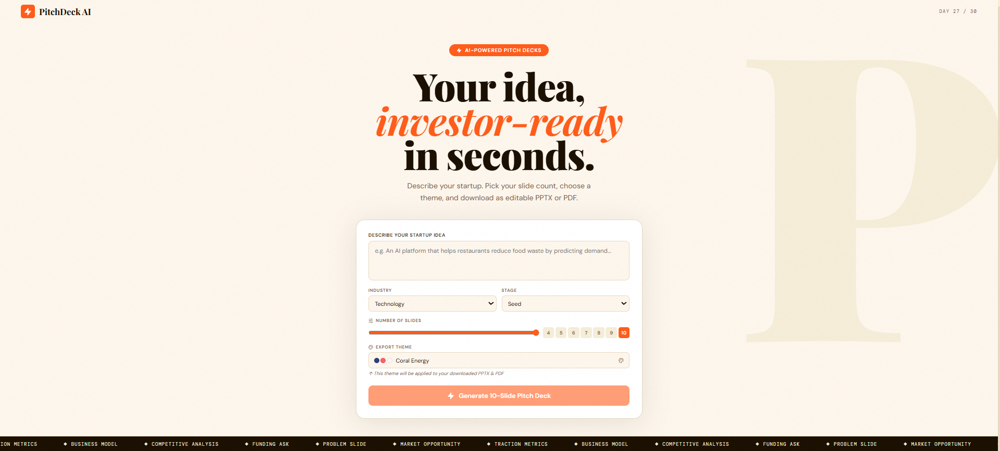
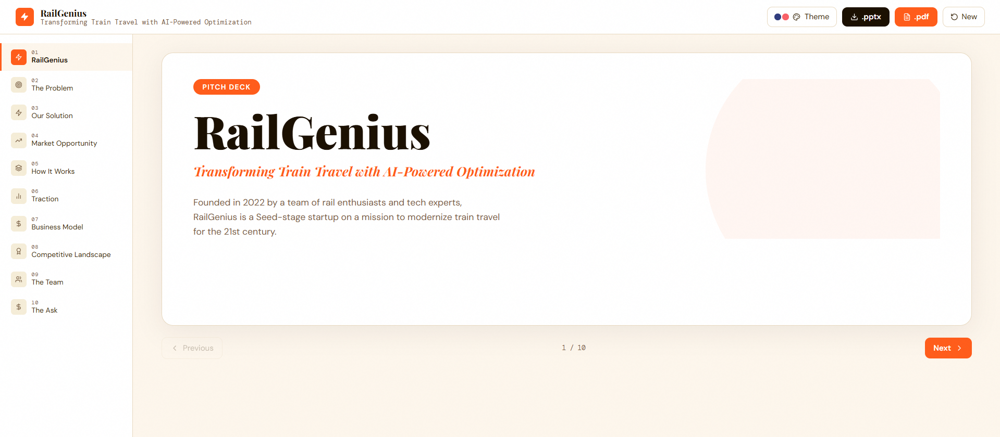

# PitchDeck AI 🚀
AI-powered startup pitch deck generator

Describe your startup idea, pick how many slides you want, choose a color theme, and get a full investor-ready pitch deck. Download as an editable `.pptx` or themed `.pdf`.

---





---
FRONTEND_URL = https://pitchdeckai-1.onrender.com

## Features
- AI generates 4–10 slides from a single idea (cover, problem, solution, market, product, traction, business model, competition, team, ask)
- **Slide count picker** — slider + quick-tap 4–10 buttons
- **6 export themes** — Midnight Executive, Coral Energy, Forest & Moss, Berry & Cream, Charcoal Minimal, Ocean Deep
- **Download PPTX** — editable in PowerPoint/Keynote, full shapes + colors
- **Download PDF** — fully styled with theme colors via reportlab (no LibreOffice needed)
- Animated slide viewer with sidebar nav

---

## Stack
| | |
|---|---|
| Backend | FastAPI + Python 3.12 |
| AI | Groq LLaMA 3.3 70B (free) |
| PPTX | python-pptx |
| PDF | reportlab |
| Frontend | React 18 + Vite |
| State | Zustand |
| Animations | Framer Motion |

---

## Quick Start

### 1. Backend
```bash
cd pitchdeck/backend
python -m venv venv && source venv/bin/activate  # Windows: venv\Scripts\activate
pip install -r requirements.txt

# .env
echo "GROQ_API_KEY=your_key_here" > .env

uvicorn app.main:app --reload
# → http://localhost:8000
```

### 2. Frontend
```bash
cd pitchdeck/frontend
npm install
npm run dev
# → http://localhost:5173
```

Get your free Groq API key at **console.groq.com**

---

## API
| Method | Endpoint | Description |
|---|---|---|
| POST | `/api/generate` | Generate pitch JSON |
| POST | `/api/export` | Download PPTX or PDF |
| GET | `/api/themes` | List themes |
| GET | `/api/health` | Health check |

**Generate body:**
```json
{ "idea": "...", "industry": "Technology", "stage": "Seed", "slide_count": 8 }
```

**Export body:**
```json
{ "pitch": {...}, "theme": "midnight", "format": "pptx" }
```

---

## Deploy to Render

**Backend** — Web Service
- Root dir: `pitchdeck/backend`
- Build: `pip install -r requirements.txt`
- Start: `uvicorn app.main:app --host 0.0.0.0 --port $PORT`
- Env: `GROQ_API_KEY`

**Frontend** — Static Site
- Root dir: `pitchdeck/frontend`
- Build: `npm install && npm run build`
- Publish: `dist`

---

## Troubleshooting
- After pulling new code, always **stop and restart** the Vite dev server (`Ctrl+C` then `npm run dev`) — hot reload doesn't always pick up store changes
- If the deck viewer crashes after clicking "New", clear browser cache or hard-refresh (`Ctrl+Shift+R`)
